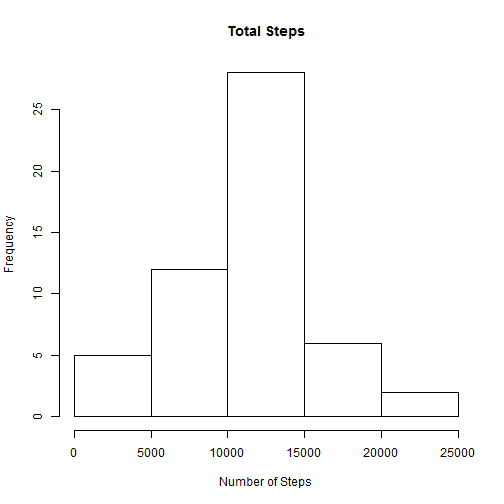
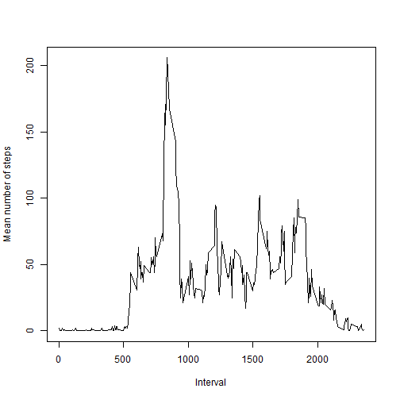
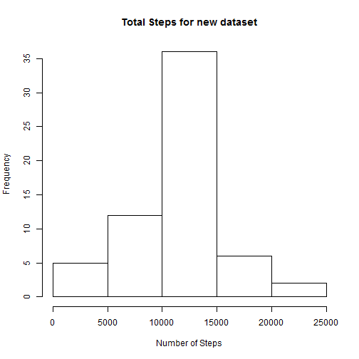
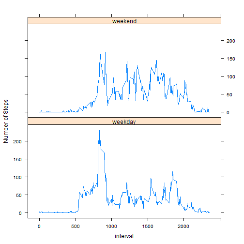

# Peer Assignment 1

## Loading and prepocessing the data

The downloaded zip file is extracted into a csv format and saved into the 
working folder. Then, the data is loaded into R.


```r
Data <- read.csv("activity.csv")
```

After loading the data, data is preprocessed by removing any missing values.


```r
NATestData <- complete.cases(Data)
NewData <- Data[NATestData,]
```

## What is mean total number of steps taken per day?

Next, we make a histogram of the total number of steps taken each day.


```r
suppressMessages(library("dplyr"))
Grouped_Data <- group_by(NewData, date)
Summarized_Data <- summarise(Grouped_Data, sum(steps))
TotalSteps <- Summarized_Data[,2][[1]]
hist(TotalSteps, main = "Total Steps", xlab = "Number of Steps")
```

 

Then, we calculate the mean and median of the total number of steps taken per day.


```r
summary(TotalSteps)
```

```
##    Min. 1st Qu.  Median    Mean 3rd Qu.    Max. 
##      41    8841   10760   10770   13290   21190
```

## What is the average daily activity pattern?

For this question, we can plot time vs the average number of steps.


```r
Interval_Data <- group_by(NewData, interval)
Interval_AverageData <- summarize(Interval_Data, round(mean(steps)))
plot(Interval_AverageData, xlab = "Interval", ylab ="Mean number of steps", type ='l')
```

 

To identify the interval that contains maximum number of steps, the peak point is
identified and the respective interval name is printed.


```r
Interval_AverageData[[1]][which.max(Interval_AverageData[[2]])]
```

```
## [1] 835
```

## Imputing missing values

In this part of the assignment, we will calculate the number of missing values.


```r
sum(NATestData == FALSE)
```

```
## [1] 2304
```

Next, we shall replace these NA values with the mean for that particular 5 minute
interval.


```r
ImputedData <- Data
NAData <- which(NATestData == FALSE)
for (i in 1:length(NAData))
{
    ImputedData[NAData[i],1] <- Interval_AverageData[which(Interval_AverageData[,1] == ImputedData[NAData[i],3]),2]  
}
```

A new data set is created. Let us plot a histogram for the new dataset.


```r
Grouped_Data1 <- group_by(ImputedData, date)
Summarized_Data1 <- summarise(Grouped_Data1, sum(steps))
TotalSteps1 <- Summarized_Data1[,2][[1]]
hist(TotalSteps1, main = "Total Steps for new dataset", xlab = "Number of Steps")
```

 

Next, we calcualte and compare the mean and median of the new data set.


```r
summary(TotalSteps)
```

```
##    Min. 1st Qu.  Median    Mean 3rd Qu.    Max. 
##      41    8841   10760   10770   13290   21190
```

```r
summary(TotalSteps1)
```

```
##    Min. 1st Qu.  Median    Mean 3rd Qu.    Max. 
##      41    9819   10760   10770   12810   21190
```

The mean and median of the datasets are found to be similar. The effect of imputing 
is trivial. However, the frequency of 10000 - 15000 steps section has gone up.

## Are there differences in activity patterns between weekdays and weekends?

In this section, we try to compare the activity levels between weekdays and weekends
First, we assign a factor variable to the data set.


```r
DateData <- as.Date(ImputedData$date, format="%Y-%m-%d")
WDData <- weekdays(DateData)
Day <- factor(levels = c("weekday","weekend"))
for (j in 1:length(WDData))
{
    if (WDData[j] == "Saturday" || WDData[j] == "Sunday")
    {
        Day[j] <- "weekend"
    }
    else
    {
        Day[j] <- "weekday"
    }
}
ImputedData$Day <- Day
```

Next, let us calculate the average number of steps across all intervals during
weekdays and weekends.


```r
TestData <- group_by(ImputedData,Day,interval)
Summarized_Data2 <- summarize(TestData, round(mean(steps)))
names(Summarized_Data2)[3] <- "steps"
library("lattice")
xyplot(steps ~ interval | Day, data = Summarized_Data2, layout = c(1,2), type ='l', ylab = "Number of Steps")
```

 

From the plot, it seems the person on an average walks higher throughtout the day
during the weekend. However, his peak occurs during a certain time period on a weekday.
